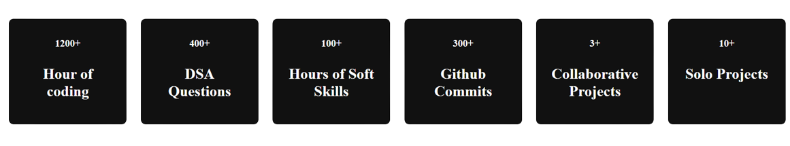

<h1 align="center"> Hi  I'm <a href="https://www.linkedin.com/in/sudarshancr098/"target="_blank"> Sudarshan... </a>  </h1>
<h1 align="center">   </h1>

<h2>🚀 About Me</h2>

Highly detail-oriented and organized Java Backend developer with excellent technical and communication skills.Passionate about coding and Self-motivated with a keen interest in building user-centric products. Looking forward to utilizing my skills in a challenging work environment. I'm also an enthusiastic learner who's constantly working to learn new things and improve my skills to be the best version of myself.

   
   
  

   
  

   
   
- 👩‍💻 I'm currently working on improving my skills.

- 🧠 I'm currently learning Full-Stack Web Development.

- 💬 Ask me about Java/DSA/JS/HTML/CSS/MySQL/Hibernate/Spring Boot.

- Checkout my [Portfolio](https://Sudharshan098.github.io/)
 
<h2 align="left"><i>Tech Stack :</i></h2>

 

       

<h2 align="left"><i>Connect with me:</i></h2>

  
  
   
   

 
   
<h2 align="left">📊<i> My Static :</i></h2>
 

<h2 align="left">📊<i> My Github Stats :</i></h2>

  
  

  
   

  
  

